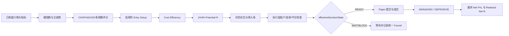

# jiaoyi2

多账户交易策略服务，包含经典策略、智能趋势策略、兼容版 **Trend Only V1**、稳定对照版 **Trend Only V2** 和 Paper 实验版 **Trend Only V3**。

Trend Only V3 将趋势识别、入场质量、成本、风险和执行状态解耦，通过评分、分层状态机与统一净收益口径减少错误过滤。V3 默认且强制使用 Paper；V2 保持稳定对照，V1 保留供旧账户兼容，三个版本都不会被自动删除。

## 安装

需要 Node.js 22，以及 Extended 平台使用的 Python 3 环境。

```bash
npm ci
cp config.example.json config.json
cp auth.example.json auth.json
npm test
npm start
```

浏览器访问 `http://服务器地址:3000`。

## 安全说明

- 示例配置默认使用 Paper 模式。
- 首次将账户切换为 Trend Only 时，服务会强制切到 Paper；V3 在完成 Forward Test 前不允许 Live。
- Live 新开仓必须针对当前信号二次确认，确认不会持久化，且 60 秒后失效。
- 所有订单都使用 `clientOrderId`；超时后保留未知订单状态，并先向交易所查询，禁止直接重复提交。
- `config.json`、`auth.json`、运行态、成交历史和私钥文件已加入 `.gitignore`，不要提交这些文件。
- 停止趋势监控只会阻止新开仓；已有趋势仓位仍继续执行保护性退出。
- Live 前必须配置可用的交易所凭证；Hyperliquid/Binance 的 V2 仓位成交后会立即创建交易所原生保护止损，同步失败会进入 `risk_lock`。
- V2 会按真实成交价重新校验止损与实际风险；实际风险超过计划 15% 时进入 `POST_FILL_RISK_LOCK`，无法建立合法止损时立即 reduce-only 退出。
- `auth.json` 的旧明文密码仅用于兼容迁移；首次成功登录后会自动改存为 scrypt `passwordHash`，登录失败会被限流。
- 生产环境必须由 HTTPS 反向代理提供服务，并设置 `TRUST_PROXY=true`（或 `HTTPS_PROXY_ENABLED=true`）；生产 Cookie 强制 `HttpOnly`、`Secure`、`SameSite=Lax`。
- Extended Live 趋势下单暂未开放，请使用 Paper 或切换 Hyperliquid/Binance。

## Trend Only V3 Paper 实验

V3 不是“降低阈值的 V2”。它保留数据异常、系统风险、周末、CHOP ≥ 61.8、强高周期冲突和非法止损等硬阻断，其余市场条件进入可解释评分：主趋势结构、趋势强度、多周期关系、市场环境、入场质量与成本效率共同构成 100 分。

- Grade A 默认 82 分，使用 1.0 倍风险；Grade B 默认 74 分，使用 0.5 倍风险。标准单笔风险为权益的 1%，不会通过提高杠杆放大风险。
- Pullback、Breakout、Continuation 是三个独立入场引擎；追单、成本超过 0.15R 或前方结构空间低于 1.8R 时等待或放弃 setup。
- 初始止损采用结构失效位与 ATR 缓冲；止损越远，仓位越小，Effective Risk 同时包含价格止损与预估往返成本。
- 1R 仅记录里程碑，1.5R 才允许移动到包含交易成本的净保本，2.5R 锁定利润，3R 后按已收盘 K 线、确认 swing 与 ATR 追踪。
- ADX 下降、DI 交叉、EMA20 穿越、15m 反向等单一弱信号只进入 Defensive，不会立即平仓。
- 首页 Trading Decision Cockpit 显示当前决策、趋势评分、Setup、风险、Decision Funnel、候选机会或持仓驾驶舱；技术指标默认收在高级诊断中。
- V2 Shadow 仅计算对照，永远没有下单权限；Missed Opportunity 与 Post Exit Analytics 都带有 post-hoc 标识，绝不参与实时决策。
- 历史记录保存 `strategyVersion`、`experimentId` 与 `configHash`，默认不跨版本、实验或配置混算；统计统一使用 `netPnl` 与 `netR`。
- “策略分析”按 Breakout、Pullback、Continuation 展示样本、胜率、Avg Net R、Net Expectancy、Profit Factor、净盈亏与 Fee Drag，不自动评价哪种模式最好。

### V3 配置与数学口径

V3 参数页只展示真实参与策略的配置：账户风险与周期参数、ATR/ADX/CHOP/EMA 周期、`chopIdealMax/chopTransitionMax/chopHardBlock`、四级 ADX 阈值、`minDiSpread`、`higherTimeframeMode`、`entryModes`、三种入场及压缩参数、结构/ATR 止损参数、Defensive/Trailing 参数、成本与 Potential R 上限、再入场窗口、实验与 Shadow 开关。继承自旧版本但 V3 不使用的 `enabled`、`weekendMode`、`weekendExitHourUTC`、`minAdxToTrade`、`breakEvenAtR`、`timeStopBars`、`minProfitForTimeStopR`、`requireMultiTimeframeConfirm`、`softBreakEvenAtR`、`realBreakEvenAtR`、`reentryCooldownBars` 已从 V3 UI 隐藏。

- `riskBudgetU = equity × riskPerTrade × gradeRiskMultiplier`
- `initialPriceRiskU = qty × |entryPrice - initialStopLossPrice|`
- `expectedCostPerUnit = entryPrice × roundTripCostRate`；有真实入场费后改用真实入场费加预计出场费/滑点
- `initialEffectiveRiskU = initialPriceRiskU + qty × expectedCostPerUnit`
- `floatingNetR = (estimatedGrossPnl - estimatedTradingCost) / initialEffectiveRiskU`
- `realizedNetR = finalNetPnl / initialEffectiveRiskU`
- `netBreakEvenPrice = entryPrice ± expectedCostPerUnit`，多头加、空头减
- `potentialR = 前方已确认 1H/4H 结构空间 / stopDistance`；结构未知时进入 `WAIT_STRUCTURE_SPACE`，不再默认 2.5R



V3 至少运行 7 天，建议 14 天或累计 50 个有效候选 setup 后，再结合 Paper Forward Test、V2 Shadow 和事后错过机会审计评估参数。短期没有开仓不是调低阈值的依据。

## Trend Only V2 推荐规则

- 支持 `breakout_entry`、`pullback_entry`、`continuation_entry`，默认混合使用。
- CHOP 使用分层判断；标准模式下 45 以下为优质趋势，45–55 为趋势过渡区，55–61.8 仅允许高质量回踩，61.8 以上禁止新开仓。
- ADX 达到高位且 DI 差值明确时，不要求 ADX 持续上升，仍可识别趋势延续。
- 多周期默认使用 `not_against`：1H 必须同向，4H 只要不明显反向即可继续判断。
- 回踩确认检查最近 K 线是否曾触碰 EMA20/EMA50，不要求确认 K 线仍贴近 EMA。
- 延续入场使用 swing high / swing low 序列，不使用简单区间前后半段极值。
- 趋势衰减先进入防守模式并收紧结构/ATR 止损，确认反转后才退出。
- V2 的结构软反转使用 0.25 ATR 缓冲并连续确认 2 根 K 线；只有超过结构 0.5 ATR 或 1H、4H 同时反向才立即退出。
- 标准最小止损为 1.2 ATR，并按突破 1.3、回踩 1.0、延续 1.2 ATR 分层；止损越远会自动缩小仓位，不扩大单笔风险。
- 防守止损保留结构缓冲且距离当前价至少 0.5 ATR；小于预估往返交易成本的 EMA/DI/ADX 弱反转只进入防守模式。
- 历史凭证记录入场模式、退出原因、计划/实际风险、手续费、净盈亏以及 MAE/MFE 和对应 R 倍数。
- 历史交易页使用 9 列复盘主表、筛选与 CSV 导出；详细风控、行情表现和审计字段在“查看复盘”中展示，旧记录会明确标注未采集字段。
- Paper 保护止损默认按止损价附加 5 bps 滑点成交，避免轮询延迟制造虚假大滑点；明确跳空穿越时保留 gap 后价格并记录执行模式。
- 同一趋势退出后默认冷却 6 根 15m K 线；出现更新后的回踩或延续结构可再次入场。
- 页面提供最近 50 根已收盘 K 线的信号回放、阻断原因统计和筛选。
- 页面提供统一的“为什么不开仓”诊断，并统计最近 24/72 小时的 ADX、CHOP、多周期、追单与风控阻断次数。
- V2 参数页提供稳健、标准、灵敏三套严格度预设；灵敏模式会把单笔风险降至 0.5%，Live 选择时需要再次确认。

## Trend Only V1 兼容规则

- 10 倍杠杆，单笔风险上限为权益的 1%。
- 日亏损达到 3% 后停止新开仓。
- 连续亏损 2 次后暂停 12 小时。
- UTC 周六、周日禁止新开仓。
- V1 沿用旧版固定震荡过滤与 ADX 连续增强规则；新账户建议使用 V2 的分层判断。
- 15 分钟入场、1 小时趋势和 4 小时高周期方向必须一致。
- 1R 移动到保本，2R 锁定 1R，3R 启动 ATR 移动止盈。

## 验证

```bash
npm test
```

测试覆盖 V1/V2/V3 隔离、多空信号、评分与硬阻断、三种入场引擎、结构止损、Effective Risk、净 R/成本口径、再入场、Shadow、无前视事后分析、周末限制、历史凭证、未知订单恢复、Live 安全以及旧策略回归。
